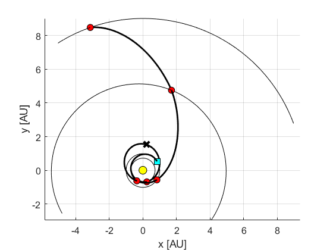

This tutorial shows how to refine trajectory solutions generated by **ASTRA** using multiple **Deep Space Manoeuvres (DSMs)**. These impulsive manoeuvres are assumed to occur between consecutive planetary encounters. It is also possible to include more than one manoeuvre in each leg of a **Multiple Gravity Assist (MGA)** mission.

For further background on this topic, you may refer to [[1]](#1) and [[2]](#2).

In order to run this tutorial, the <a href="https://it.mathworks.com/products/parallel-computing.html" target="_blank">MATLAB Parallel Computing Toolbox</a> is needed.

## Method Overview

The main model used to refine ASTRA solutions is the **MGA-nDSM** model, where one or more manoeuvres are placed between consecutive planetary encounters.

The following sections provide more detail.

### Using One DSM

After each planetary encounter, the trajectory is propagated forward to the time of the manoeuvre. From that point, a **Lambert problem** is solved to reach the next encounter. The DSM is then computed as the difference between the final velocity from propagation and the initial velocity provided by the Lambert solution.

It is also possible to specify whether a DSM should be included in the **first leg**.  
- If *not*, a Lambert arc is solved directly between the departure body and the first planetary encounter.  
- If *yes*, the initial position is taken from the object's ephemerides (see also the [ephemerides tutorial](./nasa_ephemerides.md)), while the initial velocity is defined by:

  - infinity velocity magnitude  
  - declination  
  - right ascension  

At the next encounter, the Lambert solution yields the arrival velocity, from which the incoming hyperbolic excess velocity can be derived. The fly-by parameters are then optimised:

- periapsis radius of the flyby hyperbola  
- inclination of the flyby plane  

From these, the outgoing hyperbolic excess velocity and the post-flyby spacecraft velocity are obtained, and the process is repeated.

### Using Multiple DSMs

When using multiple DSMs per leg, the principle is similar. After each planetary encounter:

1. The trajectory is propagated to the first manoeuvre point.  
2. A DSM is applied, defined by its components: ```[DSMx, DSMy, DSMz]```
3. The trajectory is then propagated to the next manoeuvre point, and so on.

If the final DSM point in the leg has been reached, a Lambert problem is solved to reach the next object. As before, the final DSM is computed as the difference between the velocity after propagation and the initial velocity from the Lambert arc.

## Mission to Saturn

Let's have a look at a mission to Saturn similar to Cassini mission. This uses an MGA trajectory that is Earth-Venus-Venus-Earth-Jupiter-Saturn, using one main DSM in the Venus-Venus leg [[3]](#3).

### Set-up

Assume you just launched an ASTRA run as from the tutorial on [trajectories to Jupiter](./trips_to_jupiter.md). Now, one can extract the Pareto front as from:

```matlab
% --> process the OUTPUT
processed_OUTPUT = postProcessOutputASTRA( OUTPUT );

% --> process the output for better user experience
paretoFront = process_paretoFront_structure( INPUT, processed_OUTPUT );
```

From the structure ```paretoFront``` one selects the preferred solutions based on user-defined objectives (e.g., launch date, departing infinity velocity, arrival infinity velocity,...). Say that you want the ```n_sol``` solution:

```matlab
path = paretoFront(n_sol).path;  % --> this encodes the trajectory
revs = paretoFront(n_sol).revs;  % --> this encodes the revolutions for the Lambert solver
res  = paretoFront(n_sol).res;   % --> this encodes the resonance (empty if no resonances are present)
```

Let's also specify the ephemerides and central body used to obtain such solution:

```
INPUT.customEphemerides = @EphSS_cartesian; % --> ephemerides used
INPUT.idcentral         = idcentral;        % --> central body (Sun in this case)
```

### Bounds and constraints

First, one needs to specify how many manoeuvres are needed for each planet-to-planet leg. A function is present that assumes 1 manoeuvre per leg for each revolution in the leg (so if the spacecraft does 2 revolutions in one leg, then 2 manoeuvres are added):

```matlab
% --> number of DSM w.r.t. the number of revolutions per leg
[NmanLeg] = revs2NmanLeg(revs);
```

Now one needs to specify the bounds for the optimisation problem. One defines these with respect to the ASTRA solution contained in ```path```:

```matlab
t0days      = 35;      % --> days plus/minus the reference launch epoch from the path
tofperc     = 10/100;  % --> percentage plus/minus the reference time of flights from the path
rpperc      = 90/100;  % --> percentage plus/minus the reference periapsis altitude from the path
ksperc      = 90/100;  % --> percentage plus/minus the reference flyby plane inclination from the path
```

The variables are the following:

- ```t0days```: Time window (in days) allowed around the reference launch epoch.
- ```tofperc```: Percentage variation permitted in the time of flight for each leg.
- ```rpperc```: Percentage variation allowed in the periapsis altitude during flybys.
- ```ksperc```: Percentage variation allowed in the inclination of the flyby plane.


Then, one specifies if a DSM is needed on the first leg. If *yes*, then the maximum and minimum infinity velocity should be specified, otherwise those values are ignored

```matlab
optFirstMan = 1;       % --> flag to check if the first leg has a manoeuvre (0 is okay for most of the cases)
vinfMin     = 0;       % --> minimum v-infinity at departure [km/s] -- only works for optFirstMan = 1;
vinfMax     = 4.0;     % --> maximum v-infinity at departure [km/s] -- only works for optFirstMan = 1;
```

Finally, one needs to specify the maximum and minimum values for the ```[DSMx, DSMy, DSMz]```, *if multiple manoeuvres are present in any of the legs*. Otherwise, this will be ignored by the optimiser.

```matlab
dvsMaxMag   = 0.5;     % --> maximum DSM magnitude [km/s] -- only works if more than one manoeuvre is present in the leg
```

One can assemble the full problem by building the lower and upper bounds, as well as passing in a structure the number of revolutions and DSMs per leg (*this behaviour might change in the future...*):

```matlab
% --> build the lower/upper bounds based on previous options
[ t0Min, t0Max, TOFMin, TOFMax, rpMin, rpMax, etaMin, etaMax, seq, path ] = ...
            minMaxFromPath(path, t0days, tofperc, rpperc, ksperc);
[epsMin, epsMax] = minMaxEps(NmanLeg);                                          % --> min. and max. fraction of time in the leg at which the manoeuvre is applied (between 0 and 1)
[dvsMin, dvsMax] = minMaxDVS(dvsMaxMag, NmanLeg);                               % --> min. and max. DSM components -- only works if multiple manoeuvres are present in one leg
[dv1Min, dv1Max] = minMaxFirstMan(vinfMin, vinfMax, optFirstMan, NmanLeg);      % --> min. and max. initial infinity velocity -- only works only works for optFirstMan = 1;
lb               = [ t0Min TOFMin dv1Min dvsMin epsMin etaMin rpMin ];
ub               = [ t0Max TOFMax dv1Max dvsMax epsMax etaMax rpMax ];

struc_revs_man.revs       = revs;       % --> revolutions per leg
struc_revs_man.NmanLeg    = NmanLeg;    % --> number of manoeuvres per leg
```

Finally, the cost function is specified, that takes into account the first delta-v (or infinity velocity if leaving a planet), plus the sum of all DSMs that are present in the trajectory, plus the final delta-v (or final infinity velocity if arriving at a planet):

```matlab
% --> define the cost function
costFun                = @(x) wrap_mga_nDSM(seq, x, struc_revs_man, INPUT.customEphemerides);
```

### Optimisation

One can now launch the optimisation. <a href="https://it.mathworks.com/help/gads/particleswarm.html" target="_blank">MATLAB Particle Swarm Optimisation (PSO)</a> is used.

First, let's define some options for the PSO:

```matlab
% --> options for the PSO
maxit       = 2;                           % --> max. iteration for the PSO
useParallel = true;                        % --> use parallel computing for the PSO (suggested: true)
optionsPSO  = optPSO(lb, ub, useParallel); % --> build the options for the PSO
```

One specifies 2 iterations for the PSO running, as this is a meta-heuristic algorithm that is not deterministic so in order to increase the chances to find good solutions multiple run might be needed.

Finally, one can run the PSO for the number of times selected, and the minimum solution is retrieved:

```matlab
% --> optimise
sol        = zeros(maxit, length(lb));
fval       = zeros(maxit, 1);
for ind = 1:maxit
    [sol(ind,:), fval(ind,:)] = particleswarm(costFun, length(lb), lb, ub, optionsPSO);
end

% --> extract the minimum solution
[minc, row] = min(fval);
minsol      = sol(row,:);
```

To plot the optimised trajectory, one re-uses the function ```wrap_mga_nDSM```:

```matlab
% --> plot
[DV, dv, t0, tofs, MAT, output] = wrap_mga_nDSM(seq, minsol, struc_revs_man, INPUT.customEphemerides, 1);
```

The final output should be something like the following trajectory. 



As it can be seen, the PSO has found a DSM of about 0.4295 km/s on the Venus-Venus leg of the transfer. The initial infinity velocity at Earth is about 4.045 km/s and the final one at Saturn is 5.131 km/s. These values are compatible with the ones of the actual Cassini mission [[3]](#3).

## References

<a id="1">[1]</a> 
Vasile, Massimiliano, and Paolo De Pascale. "Preliminary design of multiple gravity-assist trajectories." Journal of Spacecraft and Rockets 43.4 (2006): 794-805.
<a href="https://doi.org/10.2514/1.17413" target="_blank">https://doi.org/10.2514/1.17413</a>

<a id="2">[2]</a> 
Bellome, A., “Trajectory design of multi-target missions via graph transcription and dynamic programming,” Ph.D. thesis, Cranfield University, 2023.
<a href="https://dspace.lib.cranfield.ac.uk/items/711f45c8-e6e4-4f27-909d-94170df400e3" target="_blank">https://dspace.lib.cranfield.ac.uk/items/711f45c8-e6e4-4f27-909d-94170df400e3</a>

<a id="3">[3]</a> 
F. Peralta and S. Flanagan, “Cassini interplanetary trajectory design,” Control Engineering
Practice, vol. 3, no. 11, pp. 1603–1610, 1995.
<a href="https://doi.org/10.1016/0967-0661(95)00171-P" target="_blank">https://doi.org/10.1016/0967-0661(95)00171-P</a>
