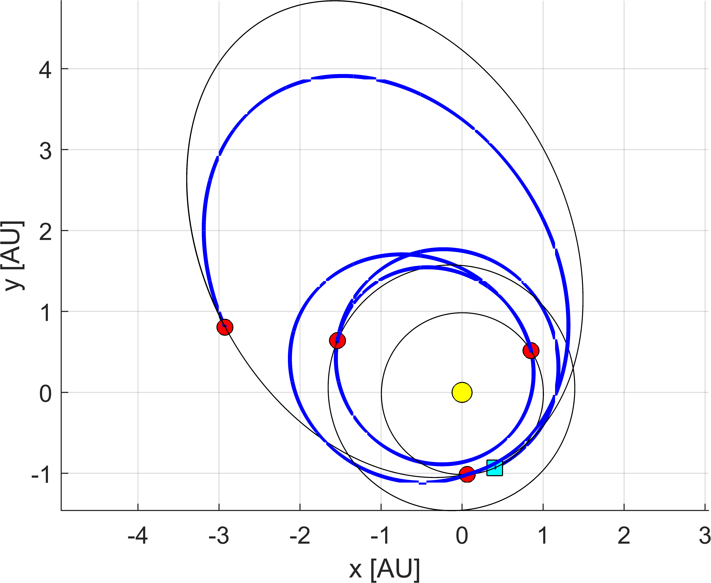
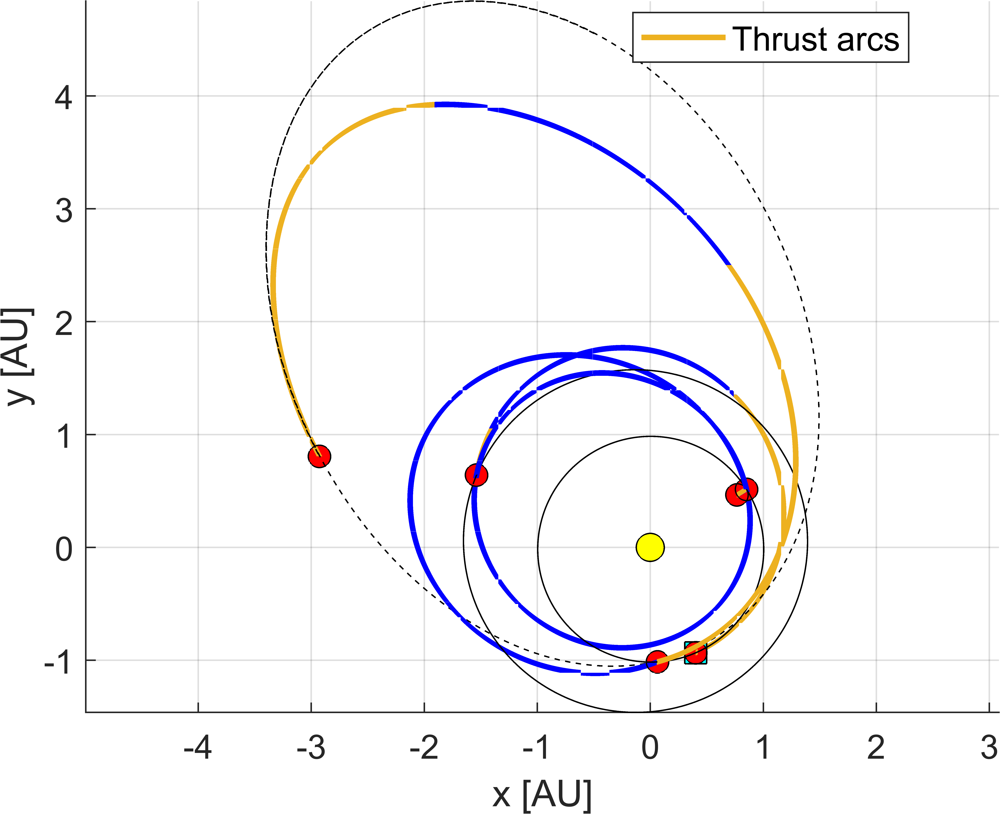
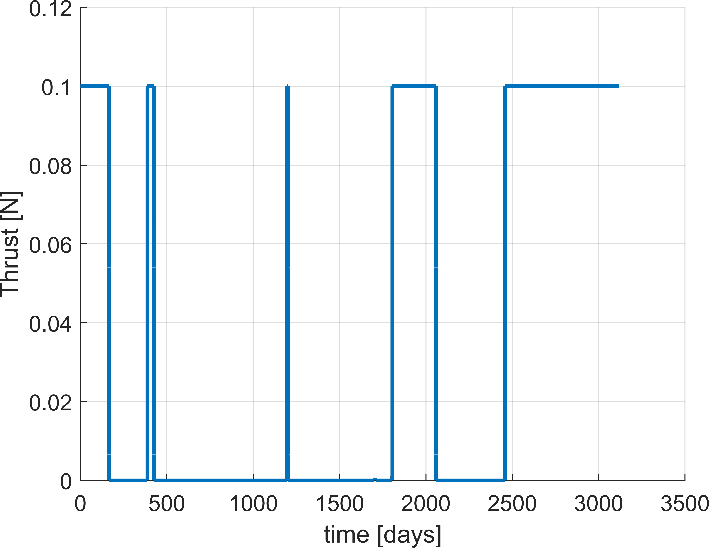
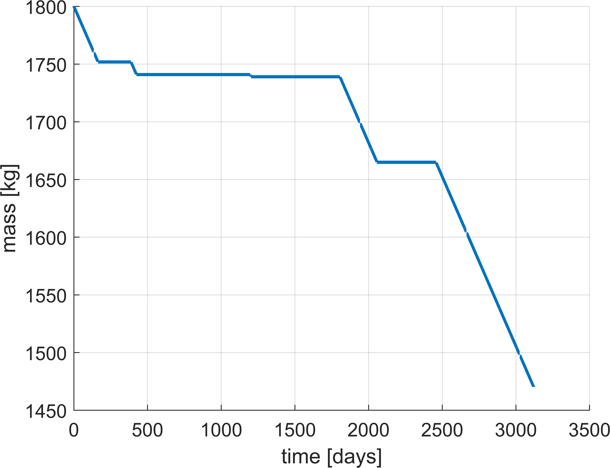
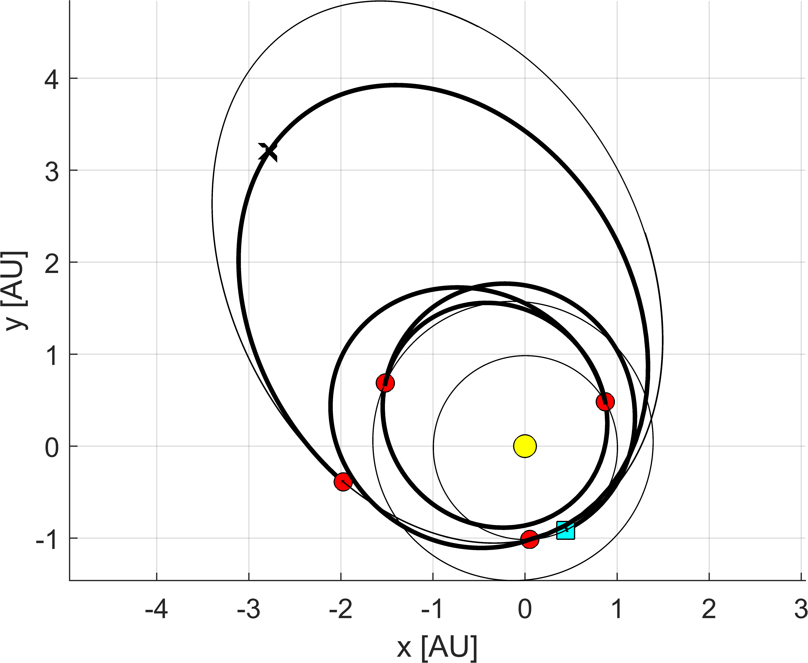
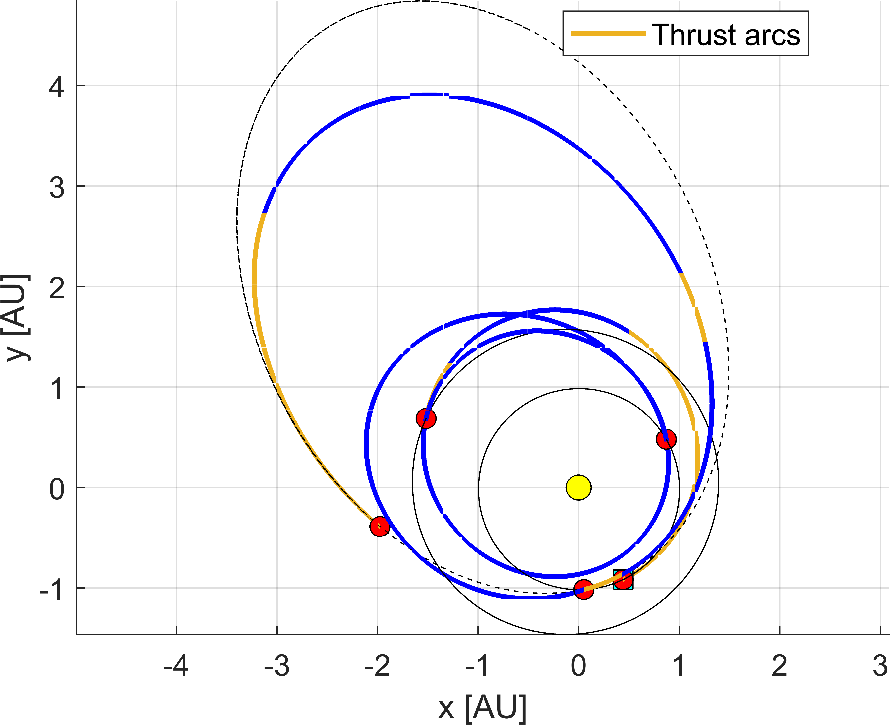
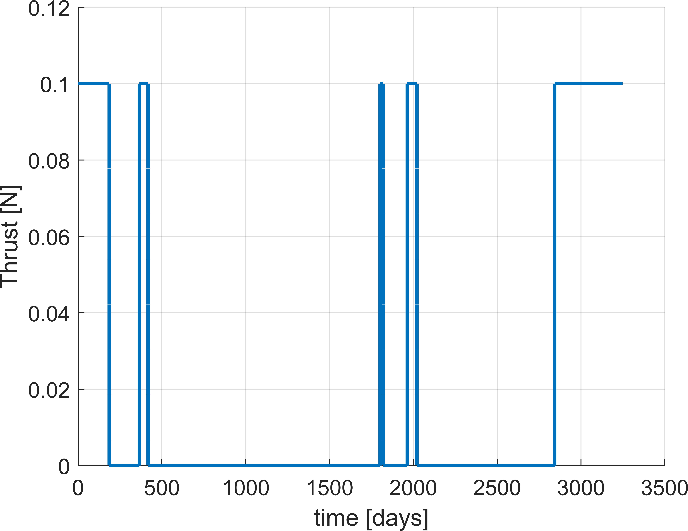
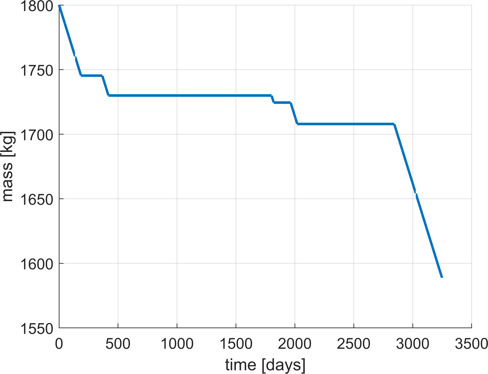

This tutorial shows how to convert trajectories coming from ASTRA into low-thrust. It has to be said that ASTRA is currently able to convert solutions by solving a **time-fixed fuel-optimal optimal control problem** on each leg of the MGA trajectory under consideration. Many references are available, but the main ones that inspired us are [[1]](#1) and [[2]](#2). Other OCPs (e.g., fuel-optimal time-fixed with variable thrust) are currently not available in ASTRA. 

<!-- It is important to recall that currently ASTRA supports the solution to the following optimal control problems (OCPs):

- Energy-optimal time-fixed optimal control problem
- Fuel-optimal time-fixed optimal contorl problem
- Time-optimal control problem (*soon to be released...*)

Other OCPs (e.g., fuel-optimal time-fixed with variable thrust) are currently not available in ASTRA.  -->

## Converting ASTRA solution to low-thrust

Assume you just launched an ASTRA run as from the tutorial on [trajectories to Jupiter](./trips_to_jupiter.md). Now, one can extract the Pareto front as from:

```matlab
% --> process the OUTPUT
processed_OUTPUT = postProcessOutputASTRA( OUTPUT );

% --> process the output for better user experience
paretoFront = process_paretoFront_structure( INPUT, processed_OUTPUT );
```

From the structure ```paretoFront``` one selects the preferred solutions based on user-defined objectives (e.g., launch date, departing infinity velocity, arrival infinity velocity,...). Say that you want the first solution:

```matlab
path = paretoFront(1).path;  % --> this encodes the trajectory
revs = paretoFront(1).revs;  % --> this encodes the revolutions for the Lambert solver
res  = paretoFront(1).res;   % --> this encodes the resonance (empty if no resonances are present)
```

Then, one can build the following structure:

```matlab
% --> extract ASTRA solution
astraSolution.path      = path;             % --> ASTRA solution
astraSolution.revs      = revs;             % --> revolutions' options from ASTRA solution
astraSolution.res       = res;              % --> resonances' options from ASTRA solution
astraSolution.vdep_free = vdep_free;        % --> v-infinity provided by launcher 'for free' [km/s]
astraSolution.varr_free = varr_free;        % --> arrival infinity velocity 'for free' [km/s]
```

One notices that:

- ```vdep_free``` is the infinity velocity provided by the launcher, and thus the thrusting system shoud not provide it. When departing from a comet/asteroid, this should be put to 0, to simulate the departing burn (i.e., leaving the comet/asteroid orbit).

- ```varr_free``` is the maximum infinity velocity admissible at the arrival. When arriving at a comet/asteroid, this should be put to 0, to simulate the rendezvous.

Then one needs to set-up the thrusting system:

```matlab
% --> define low-thrust parameters
lowThrustParameters.Tmax        = 0.1;      % --> max. thrust                       [N]
lowThrustParameters.Isp         = 3000;     % --> specific impulse                  [s]
lowThrustParameters.m0          = 1800;     % --> initial mass                      [kg]    
lowThrustParameters.g0          = 9.80665;  % --> Earth acceleration at sea level   [m/s]
```

And some specific parameters for the solver:

```matlab
% --> further optional parameters for optimal control solution
lowThrustParameters.gamma       = 0.5;      % --> discount factor for the smoothing parameter (default is 0.5)
lowThrustParameters.plot        = true;     % --> this plots the thrust evolution over time for different rho (default is false)
lowThrustParameters.useParallel = true;     % --> if true, uses parallel for fsolve (default is false)
lowThrustParameters.rhoLim      = 1e-4;     % --> limit on smoothing parameter (default is 1e-5)
```

The most critical ones are ```gamma``` and ```rhoLim``` and their impact is discussed in Ref [[1]](#1). Essentially:

- ```gamma``` is the factor that allows progressive transition from smooth to non-smooth optimal control problem. Typical values are in the range ```0.5``` to ```0.9```. A higher value might help when short burns are found, at the price of higher computational effort. A small value makes the whole routine faster, but might be too aggressive in some cases. The user should decide on a case-to-case basis (```0.75``` is suggested for most cases).

- ```rhoLim``` is the limit on the **smoothness** of the fuel-optimal problem. A small value corresponds to a more optimal thrust profile, at the price of increased computational effort (some numerical issues might even prevent solutions to appear). A high value correspopnds to less accurate solution to the fuel-optimal problem. A trial-and-error approach identified values between ```1e-3``` to ```1e-5``` to be sufficiently good ones, as a compromise between computational effort and solutions quality. In other words, for values smaller than those, no significant improvement on the final mass is registered for the interplanetary transfers considered in ASTRA.

Finally, one can launch the solver:

```matlab
% --> find low-thrust transfers from ASTRA solution      
[LT_SOLUTION, struc] = lowThrustFromASTRASolution( astraSolution, lowThrustParameters, INPUT.idcentral, INPUT.customEphemerides );
```

that attempts to solve **fuel-optimal time-fixed optimal control problem** for each leg of the ASTRA trajectory.

It has to be noticed that one requires in input ```INPUT.customEphemerides``` that depends upon the user. See [this tutorial](./custom_input.md). 

One can finally plot the resulting trajectories, mass, and thrust evolutions:

```matlab
% --> plot the final output
close all; clc;

planets = [struc.idD, struc(end).idA];
t0      = struc(1).tD;
tend    = struc(end).tA;

[figTRAJ, figMASS, figTHRmag] = wrapPlotLTFull(LT_SOLUTION, LT_SOLUTION(1).LTsol.param);

figure(figTRAJ);
plotPLTS_tt(planets, t0, tend, INPUT.idcentral, INPUT.customEphemerides, 1, [], [], 0.5, '--');
```

An example is shown for an EMEE-1000508 (where the SPKID 1000508 corresponds to the comet <a href="https://ssd.jpl.nasa.gov/tools/sbdb_lookup.html#/?sstr=1000508" target="_blank">320P/McNaught</a>). 

In this case, the following options are used:

```matlab
vdep_free = 4; % --> km/s
varr_free = 0; % --> km/s
```

Firstly, let's take the ASTRA solution (no refinement with DSM) before and after the low-thrust solver. One notices that the largest burns are in the first leg, to compensate the required infinity velocity at the departure (the needed one is ```4.41932``` km/s), and on the last leg, to rendezvous with the asteroid (matching position and velocity).

|  |  |
|:--------------------------------------------:|:--------------------------------------------:|

The corresponding evolution of the thrust profile and the mass is shown in the figures below.

|  |  |
|:--------------------------------------------:|:--------------------------------------------:|

Final trajectory details:

- overall time of flight: **3120.5 days**
- final mass: **1470.218 kg**

## Converting MGA-nDSM solution to low-thrust

Now, let's assume that the same solution obtained before is refined with DSM (e.g., using [this tutorial](./deep_space_man.md)).

One needs to post-process the MGA-nDSM solution:

```matlab
[struc] = postProcessPathASTRA_dsm_lowThrust( dv, output, MAT, vdep_free, varr_free, idcentral, customEphemerides )
```

Then, simply passing this:

```matlab
astraSolution.struc = struc;
```

alongside the other required inputs, will make ASTRA understand that the solution to be converted to low-thrust is the one with DSM (i.e., the one encoded in ```struc```). In other words, ASTRA will only consider ```astraSolution.struc = struc;``` to solve the fuel-optimal problem, and not anymore ```astraSolution.path = path;```, even if it is specified by the user.

Below the corresponding trajectories before (left) and after (right) low-thrust conversion. One notices that the overall time of fight is increased, especially in the last leg, where a DSM of about 147.9 m/s is needed to lower the $ \Delta v $ needed to rendezvous (i.e., from 1.9047 km/s of the defects solution, to 1.2112 km/s with DSMs).

|  |  |
|:--------------------------------------------:|:--------------------------------------------:|


The corresponding evolution of the thrust profile and the mass is shown in the figures below.

|  |  |
|:--------------------------------------------:|:--------------------------------------------:|

Final trajectory details:

- overall time of flight: **3248.720 days**
- final mass: **1588.721 kg**

which indeed has higher mass compared to the previous case, at the price of increased transfer time.

## References

<a id="1">[1]</a> 
Junkins, John L., and Ehsan Taheri. "Exploration of alternative state vector choices for low-thrust trajectory optimization." Journal of Guidance, Control, and Dynamics 42.1 (2019): 47-64.
<a href="https://doi.org/10.2514/1.G003686" target="_blank">https://doi.org/10.2514/1.G003686</a>

<a id="2">[2]</a> 
Wijayatunga, Minduli C., Roberto Armellin, and Laura Pirovano. "Exploiting scaling constants to facilitate the convergence of indirect trajectory optimization methods." Journal of Guidance, Control, and Dynamics 46.5 (2023): 958-969.
<a href="https://doi.org/10.2514/1.G007091" target="_blank">https://doi.org/10.2514/1.G007091</a>
