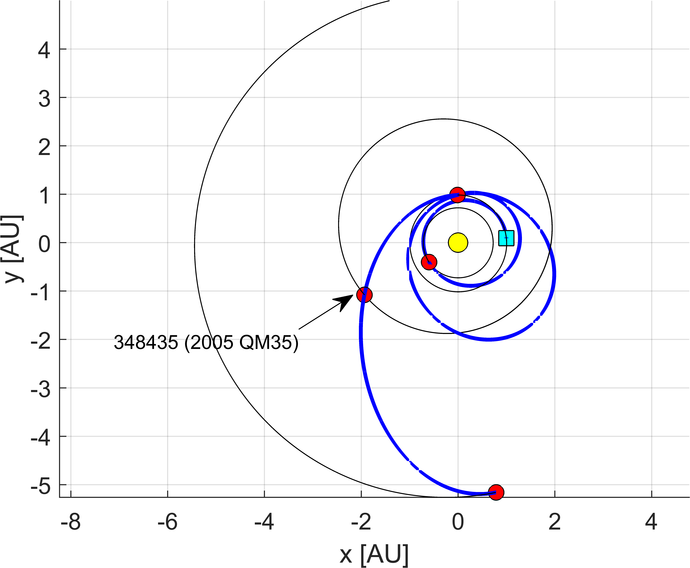

This page shows how to integrate NASA high-precision ephemerides in ASTRA. This is particularly useful when using different planetary systems or when trips to comets or asteroids are sought.

## Integrating NASA ephemerides for Solar System planets

Before considering other bodies, let's consider the Solar System planets. As from the [intallation guide](./install.md), one should have the following structure in the local directory:

```pgsql
local-folder/
├── ASTRA
├── MICE_TOOLBOX/
    ├── mice/
        ├── Kernel/
            ├── de430.bsp
            ├── gm_de431.tpc
            ├── mar097.bsp
            ├── naif0012.tls
            ├── pck00010.tpc
            └── sat375.bsp
        └── mice
├── clearDeleteAdd.m
└── main_script.m
```

The ```main_script.m``` is the one we want to modify (see, for example the tutorial on [trips to Jupiter](./trips_to_jupiter.md) or <a href="https://github.com/andreabellome/astra/blob/main/astra_with_custom_eph_mice.m" target="_blank">this script</a>).

After having set-up all the input and the ASTRA environment, one needs to load the NASA ephemerides. This can be done by imposing that:

```matlab
% --> load MICE toolbox
MICE_path = './MICE_TOOLBOX' ;
addpath(genpath(MICE_path)); % --> always include this
cspice_furnsh([MICE_path '/data.mk']);
```

In this way, one loads the kernels for planetary ephemerides. This is not sufficient. One needs to tell ASTRA which ephemerides it should use. The default ones are encoded in the script <a href="https://github.com/andreabellome/astra/blob/main/ASTRA/Ephemerides%20%26%20constants/Solar%20System/EphSS_cartesian.m" target="_blank">EphSS_cartesian.m</a>. To overwrite those, one can simply set:

```matlab
INPUT.customEphemerides = @EphSS_from_mice;
```

In particular, the function <a href="https://github.com/andreabellome/astra/blob/main/ASTRA/Ephemerides%20%26%20constants/Eph_MICE_interface/EphSS_from_mice.m" target="_blank">EphSS_from_mice.m</a> allows to automatically use the NASA ephemerides.

That's it. 

Then one can launch an optimization for the EVEMEJ similar to the tutorial on [trips to Jupiter](./trips_to_jupiter.md). Obviously, the two optimizations should provide very similar result:

- the one with **approximate ephemerides** has a minimum cost of: **8.94774 km/s** and **6.45038 years**
- the one with **NASA ephemerides** has a minimum cost of: **8.95409 km/s**  and **6.45038 years**

which indeed are very close. Thus, if one needs to plan missions to any of the Solar System planet, the approximate ephemerides are suggested, as these are quite faster to compute with respect to high-precision ones.

**BUG DETECTED: currently, high-precision NASA ephemerides prevent ASTRA to be run in parallel mode when resonances are present in the sequence. A workaround to this is shown later, but a rearchitect is needed. This will be solved in the next update...**

## Integrating NASA ephemerides for small objects

A very interesting application for integrating NASA ephemerides into ASTRA is when one needs to plan missions to Solar System objects that are not planets (asteroids and/or comets). This opens a very wide range of possibilities in terms of mission design.

If one has properly set-up the MICE toolbox as from the [intallation guide](./install.md), then the only thing that remains to do is to download the ```.bsp``` file containing the ephemerides of the desired object. The script <a href="https://github.com/andreabellome/astra/blob/main/download_nasa_ephemerides.m" target="_blank">download_nasa_ephemerides.m</a> shows how to do it and the steps are reported here.

As always, one needs to add ASTRA and MICE_TOOLBOX to the path:

```matlab
% --> load ASTRA
clearDeleteAdd; % --> !!! ONLY CALL IT ONCE FOR SPEED

% --> load mice
MICE_path = './MICE_TOOLBOX';
addpath(genpath(MICE_path)); % --> always include this
cspice_furnsh([MICE_path '/data.mk']);
```

Then, one selects the central body, and the time-span for the ephemerides validity:

```matlab
% --> central ID (Sun in this case)
idcentral = 1;

% --> lower and upper bounds for ephemerides
t0 = [ 2030 1 1 12 0 0 ];
tf = [ 2100 1 1 12 0 0 ];
```

One now needs the SPKID of the object (in this case a comet is used):

```matlab
% --> SPKID of the object (found at https://ssd.jpl.nasa.gov/tools/sbdb_lookup.html#/)
spk_id = 1000508;
```

SPKID of small bodies can be found at <a href="https://ssd.jpl.nasa.gov/tools/sbdb_lookup.html#/" target="_blank">NASA Small Body Database Lookup</a> page.

One finally specifies the folder where the file should be downloaded (default path is used here):

```matlab
% --> set the path where to save the ephemerides
spk_dir = pwd;
```

and finally one can call the NASA API:

```matlab
% --> run the code (if success=1 then everything is okay)
success = getSPK(num2str(spk_id), num2str(t0), num2str(tf), spk_dir, 'overwrite', 'on');
```

If everything is set-up properly, then one should have a file called ```1000508.bsp``` in the specified target folder.

ASTRA is now ready to be run with the newly-generated ephemerides. The set-up is very similar as before. The desired comet has now ID that is ```1000508``` and thus the ASTRA set-up will be like:

```matlab
% --> sequence to be optimized
INPUT.idcentral = 1; % --> central body (Sun in this case)

seq = [ 3 2 3 3 1000508 ]; res = [ 2 1 3 ];

%%%%%%%%%% multi-rev. options %%%%%%%%%%
maxrev                        = 1;                                                          % --> max. number of revolutions (round number)
chosenRevs                    = differentRuns_v2(seq, maxrev);                              % --> generate successive runs
[INPUT.chosenRevs, INPUT.res] = processResonances(chosenRevs, res);                         % --> process the resonances options
[INPUT.chosenRevs]            = maxRevOuterPlanets(seq, INPUT.chosenRevs, INPUT.idcentral); % --> only zero revs. on outer planets
%%%%%%%%%% multi-rev. options %%%%%%%%%%

%%%%%%%%%% set departing options %%%%%%%%%%
t0 = date2mjd2000([2030 1 1 12 0 0]); % --> initial date range (MJD2000)
tf = t0 + 5*365.25;                  % --> final date range (MJD2000)
dt = 3;                            % --> step size (days)
INPUT.depOpts = [t0 tf dt];
%%%%%%%%%% set departing options %%%%%%%%%%

%%%%%%%%%% set options %%%%%%%%%%
INPUT.opt      = 4;          % --> (1) is for SODP, (2) is for MODP, (3) is for DATES - SODP, (4) is for YEARS - MODP
INPUT.vInfOpts = [0 5];      % --> min/max departing infinity velocities (km/s)
INPUT.dsmOpts  = [1 Inf];    % --> max defect DSM, and total DSMs (km/s)
INPUT.plot     = [1 1];      % --> plot(1) for Pareto front, plot(2) for best traj. DV
INPUT.parallel = false;       % --> put true for parallel, false otherwise
INPUT.tstep    = dt;         % --> step size for Time of flight            
%%%%%%%%%% set options %%%%%%%%%%
```

Finally, one loads the ephemerides of the comet:

```matlab
% --> load custom ephemerides
MICE_path = './MICE_TOOLBOX';
addpath(genpath(MICE_path)); % --> always include this
cspice_furnsh([MICE_path '/data.mk']);

spk_dir = [];           % --> location of the bsp file with object ephemerides (if empty, then the current directory is used)
cspice_furnsh([ pwd '\' spk_dir '\' num2str(max(seq)) '.bsp']); % --> load the object ephemerides
```

As before, the ephemerides as passed to ASTRA as:

```matlab
INPUT.customEphemerides = @EphSS_from_mice_workaround;
```

Please, note that in this case the ephemerides are loaded with a workaround to prevent the aforementioned bug to appear. Basically, <a href="https://github.com/andreabellome/astra/blob/main/ASTRA/Ephemerides%20%26%20constants/Eph_MICE_interface/EphSS_from_mice_workaround.m" target="_blank">EphSS_from_mice_workaround.m</a> loads the approximate positions of the planets (that are proved to work well for planets), thus avoiding the bug, while for the desired object it uses the NASA kernels.

One notices here that a scan of 5 years is set-up for this specific example, and thus one has that ```INPUT.opt=4``` (i.e., every year, multi-objective dynamic programming is used).

## Performing asteroid fly-bys with NASA ephemerides in ASTRA

It has to be said that one can also write sequences of objects that simulate asteroids fly-bys. In this case, ASTRA will consider them as massless points in space (so zero sphere of influence). 

Let's take the following example. 

```matlab
% --> clear INPUT and define new ones
try clear INPUT; catch; end; clc;

% --> sequence to be optimized
INPUT.idcentral = 1; % --> central body (Sun in this case)
seq = [ 3 2 3 3 20348435 5 ]; res = [ 2 1 3 ];

%%%%%%%%%% multi-rev. options %%%%%%%%%%
maxrev                        = 1;                                                          % --> max. number of revolutions (round number)
chosenRevs                    = differentRuns_v2(seq, maxrev);                              % --> generate successive runs
[INPUT.chosenRevs, INPUT.res] = processResonances(chosenRevs, res);                         % --> process the resonances options
[INPUT.chosenRevs]            = maxRevOuterPlanets(seq, INPUT.chosenRevs, INPUT.idcentral); % --> only zero revs. on outer planets
%%%%%%%%%% multi-rev. options %%%%%%%%%%

%%%%%%%%%% set departing options %%%%%%%%%%
t0 = date2mjd2000([2037 1 1 0 0 0]); % --> initial date range (MJD2000)
tf = t0 + 1*365.25;                  % --> final date range (MJD2000)
dt = 2.5;                            % --> step size (days)
INPUT.depOpts = [t0 tf dt];
%%%%%%%%%% set departing options %%%%%%%%%%

%%%%%%%%%% set options %%%%%%%%%%
INPUT.opt      = 2;          % --> (1) is for SODP, (2) is for MODP, (3) is for DATES, (4) is for YEARS - MODP
INPUT.vInfOpts = [0 5];      % --> min/max departing infinity velocities (km/s)
INPUT.dsmOpts  = [1 Inf];    % --> max defect DSM, and total DSMs (km/s)
INPUT.plot     = [1 1];      % --> plot(1) for Pareto front, plot(2) for best traj. DV
INPUT.parallel = true;       % --> put true for parallel, false otherwise
INPUT.tstep    = dt;         % --> step size for Time of flight            
%%%%%%%%%% set options %%%%%%%%%%

%%

% --> load custom ephemerides
MICE_path = './MICE_TOOLBOX';
addpath(genpath(MICE_path)); % --> always include this
cspice_furnsh([MICE_path '/data.mk']);

spk_dir = [];           % --> location of the bsp file with object ephemerides

for inds = 1:length(seq)
    if seq(inds) > 9
        cspice_furnsh([ pwd '\' spk_dir '\' num2str(seq(inds)) '.bsp']); % --> load the object ephemerides
    end
end

INPUT.customEphemerides = @EphSS_from_mice_workaround;

%% --> optimize using ASTRA

% --> launch ASTRA optimization
OUTPUT = ASTRA_DP(seq, INPUT);
```

This considers an EVEEJ transfer with a fly-by with asteroid 20348435 (<a href="https://ssd.jpl.nasa.gov/tools/sbdb_lookup.html#/?sstr=20348435" target="_blank">348435 (2005 QM35)</a>) on the EJ leg, and a 2:1 resonance on the 3rd leg (i.e., on the EE one), and launching in 2037. The resulting sequence thus looks like the following:

```matlab
seq = [ 3 2 3 3 20348435 5 ]; res = [ 2 1 3 ];
```

In this case, ASTRA considers that the asteroids has **null mass (i.e., zero sphere of influence)**, and the fly-by is performed at the arbitrary altitude of **1000 km**. The prerequisite is to have the ```.bsp``` file of the object in the current working directory, as shown in the previous section.

The following plot shows the resulting optimal trajectory. One notices the fly-by with the desired object on the EJ leg.

