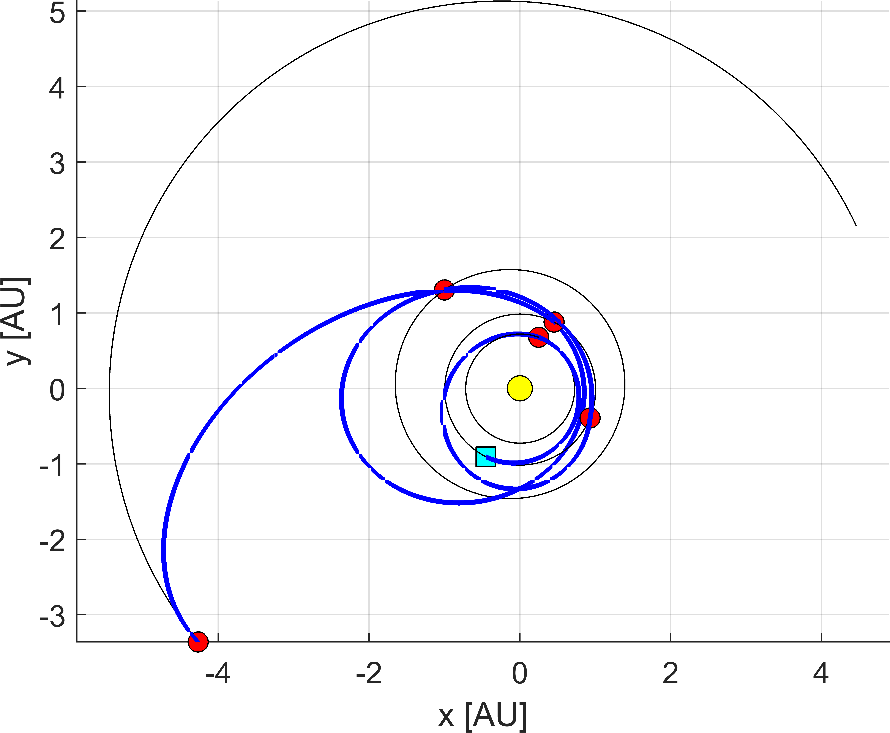
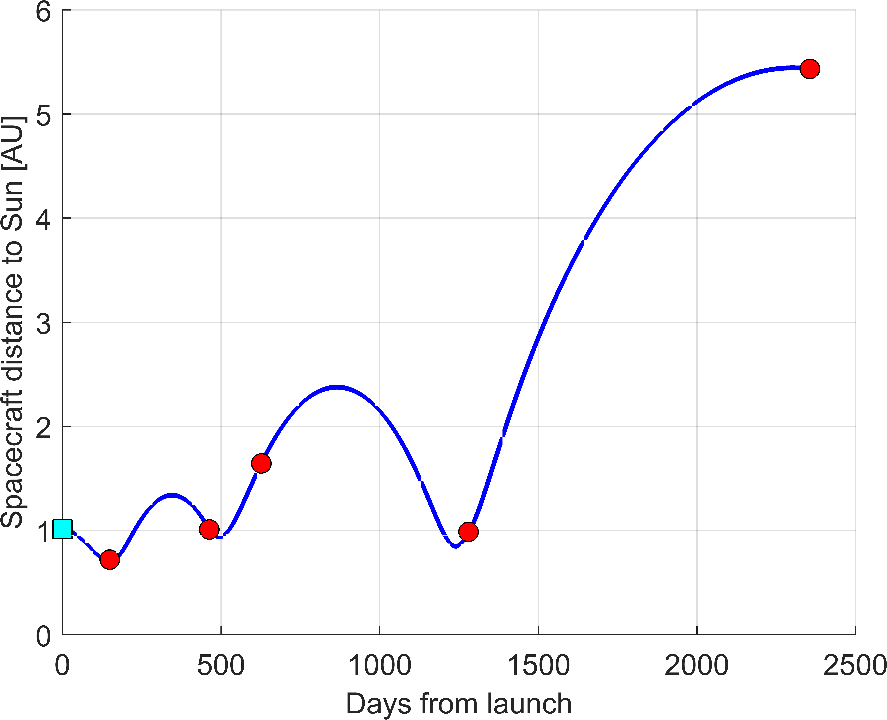

This tutorial allows to run a simple test script with ASTRA for a mission towards Jupiter. Different sequences will be optimized, just to see different options for ASTRA.

## Eath-Venus-Earth-Mars-Earth-Jupiter

First sequence to analyse is the Eath-Venus-Earth-Mars-Earth-Jupiter (EVEMEJ), that has been considered for <a href="https://www.esa.int/Science_Exploration/Space_Science/Juice" target="_blank">JUICE mission</a>.

This tutorial is based on <a href="https://github.com/andreabellome/astra/blob/main/st1_astra_main.m" target="_blank">this script</a>. This allows to optimize the sequence either with SODP (single-objective dynamic programming) or with MODP (multi-objective dynamic programming). A breakdown of the minimum input parameter needed is provided here.

From <a href="https://github.com/andreabellome/astra/blob/main/st1_astra_main.m" target="_blank">this script</a>, one needs to call ASTRA and building the mex functions (namely Lambert solver, defects function, and low-thrust module):

```matlab
clearDeleteAdd;
```

Then one proceeds to select appropriate input parameters.

```matlab
%% --> input section

% --> clear INPUT and define new ones
try clear INPUT; catch; end; clc;

% --> sequence to be optimized
INPUT.idcentral = 1; 
seq = [ 3 2 3 4 3 5 ]; res = [ ];

%%%%%%%%%% multi-rev. options %%%%%%%%%%
maxrev                        = 0;                                         % --> max. number of revolutions (round number)
chosenRevs                    = differentRuns_v2(seq, maxrev);             % --> generate successive runs
[INPUT.chosenRevs, INPUT.res] = processResonances(chosenRevs, res);        % --> process the resonances options
[INPUT.chosenRevs]            = maxRevOuterPlanets(seq, INPUT.chosenRevs); % --> only zero revs. on outer planets
%%%%%%%%%% multi-rev. options %%%%%%%%%%

%%%%%%%%%% set departing options %%%%%%%%%%
t0 = date2mjd2000([2023 1 1 0 0 0]); % --> initial date range for launch (MJD2000)
tf = t0 + 1*365.25;                  % --> final date range for launch (MJD2000)
dt = 2.5;                            % --> step size in launch window (days)
INPUT.depOpts = [t0 tf dt];
%%%%%%%%%% set departing options %%%%%%%%%%

%%%%%%%%%% set options %%%%%%%%%%
INPUT.opt      = 2;          % --> (1) is for SODP, (2) is for MODP, (3) is for DATES, (4) is for YEARS - MODP
INPUT.vInfOpts = [3 5];      % --> min/max departing infinity velocities (km/s)
INPUT.dsmOpts  = [1 Inf];    % --> max defect DSM, and total DSMs (km/s)
INPUT.plot     = [0 0];      % --> plot(1) for Pareto front, plot(2) for best traj. DV
INPUT.parallel = true;       % --> put true for parallel, false otherwise
INPUT.tstep    = dt;         % --> step size for Time of flight            
%%%%%%%%%% set options %%%%%%%%%%
```

Things to notice are:

- ```INPUT.idcentral``` allows to select the system. In this example, ```INPUT.idcentral = 1``` means that Solar System is selected. Other options are:

    - 5 for Jupiter system
    - 6 for Saturn system
    - 7 for Uranus system. See also <a href="https://github.com/andreabellome/astra/blob/main/ASTRA/Ephemerides%20%26%20constants/constants.m" target="_blank">constants.m</a> for knowing about the IDs of the bodies.
    
- ```maxrev``` is the number of revolutions for Lambert arcs. ASTRA computes all the possible permutations of revolutions per leg (both long and short option) up to the maximum desired by the user.
- ```maxRevOuterPlanets``` will prune options with more than one rev. on legs towards outer planets (i.e., from Jupiter on). This to prevent the mission duration to increase a lot.
- ```res``` is a list of integers with ```[ N, M, LEG_ID ]```, where ```N``` and ```M``` are the object and spacecraft revolutions, respectively, and ```LEG_ID``` is the number of the leg at which the resonance is. In this case, it is empty as no resonances are included in the transfer. Later, an example will be shown.
- ```INPUT.opt``` selects the type of optimization. 
  - ```1``` is for SODP
  - ```2``` is for MODP
  - ```3``` is for SODP run each launch date. 
  - ```4``` is for MODP run each launch year. If the user selects a launch window greater or equal than 3 year AND ```INPUT.opt=2```, this option is selected automatically. This allows to reduce the computational burden in terms of RAM.

The options defined above allow for an MGA trajectory search of ```Earth-Venus-Earth-Mars-Earth-Jupiter``` mission in year ```2023``` using MODP (```INPUT.opt=2```).

<!-- There is a specified 2:1 resonance on the ```Earth-Earth``` leg, i.e., ```res = [2 1 3]```. -->

ASTRA main engine can then be run using:

```matlab
%% --> optimize using ASTRA

% --> launch ASTRA optimization
OUTPUT = ASTRA_DP(seq, INPUT);
```

Results are saved in a structure called ```OUTPUT```.

If needed, one can then post-process the results, extracting the desired trajectory from the Pareto front, plotting the Pareto front itself and the selected path.

```matlab
% --> process the OUTPUT
processed_OUTPUT = postProcessOutputASTRA( OUTPUT );

% --> process the output for better user experience
paretoFront = process_paretoFront_structure( INPUT, processed_OUTPUT );
```

Specfically, the structure ```paretoFront``` has all the relevant information about the trajectories on the Pareto front that are easily interpretable. In particular, the default objective functions to be minimized and represented in the plots are:

- overall $ \Delta v$ consumption (that is the departing infinity velocity $ v_{\infty,dep} $, sum of defects and arrival infinity velocity $ v_{\infty,arr}$)
- overall time of flight

Custom objective functions can also be included as shown in [another tutorial]().

Once the pareto front is extracted, one can plot it:

```matlab
% --> plot the Pareto front
figPareto = plotPareto(processed_OUTPUT.PARETO_FRONT);
```


A specific trajectory (variable ```path``` in the ```paretoFront``` structure) can also be extracted and plotted.

```matlab
row  = length(paretoFront);   % --> select the path to plot (minimum DV in this specific example)
path = paretoFront(row).path;
revs = paretoFront(row).revs;
res  = paretoFront(row).res;

% --> plot the path
[figECI, STRUC, figSYN, figRSC, figVSC] = plotPath(path, INPUT.idcentral);
```

The plot of the optimal trajectory in inertial and Earth-Sun synodic frame is the following:

|  |  |
|:--------------------------------------------:|:--------------------------------------------:|

The function <a href="https://github.com/andreabellome/astra/blob/main/ASTRA/Plot%20and%20save/plotPath.m" target="_blank">plotPath.m</a> also allows to plot the evolutions of spacecraft distance and velocity with respect to central body:

|  |  |
|:--------------------------------------------:|:--------------------------------------------:|

The function <a href="https://github.com/andreabellome/astra/blob/main/ASTRA/Plot%20and%20save/generateOutputTXT.m" target="_blank">generateOutputTXT.m</a> creates a .txt file in a folder called ```./results``` that has all the info of the trajectory.

```matlab
% --> save the output
generateOutputTXT(path, INPUT.idcentral, ...
    @EphSS_cartesian, ...
    '/target_folder', ...
    'name_of_the_file');
```

This is reported here:

```

          _/_/_/     _/_/_/  _/_/_/_/_/  _/_/_/    _/_/_/ 
        _/    _/   _/           _/     _/    _/  _/    _/ 
       _/_/_/_/     _/_/       _/     _/_/_/    _/_/_/_/  
      _/    _/         _/     _/     _/    _/  _/    _/   
     _/    _/    _/_/_/      _/     _/    _/  _/    _/    


               - ASTRA solution - 

-------------------------------------------------------------- 

Departing body                 : Earth  
Distance from the central body : 1.0000 AU 

-------------------------------------------------------------- 

Arrival body                   : Jupiter
Distance from the central body : 5.2026 AU 
Departing C3                   : 9.9710 km^2/s^2 
Departing infinity velocity    : 3.1577 km/s 
Arrival infinity velocity      : 5.5622 km/s 
Total cost (DSMs)              : 0.2279 km/s 
Total cost                     : 8.9477 km/s 
Time of flight                 : 6.4504 years 

-------------------------------------------------------------- 

MGA Details : 

Swing-by sequence      : -E--V--E--M--E--J-

Departing date         : [2023   5  25   0   0   0]
Arrival date           : [2029  11   5   0   0   0]
Time of flight per leg : 149 days 
                         314 days 
                         164 days 
                         653 days 
                         1076 days 

DSMs magnitudes        : 0 km/s 
                         0 km/s 
                         0.0435 km/s 
                         0.175 km/s 
                         0.0030602 km/s 
                         0.0062967 km/s 

Infinity velocities    : 
Earth   - Venus        : 3.1577 - 5.491 km/s 
Venus   - Earth        : 5.5345 - 8.6843 km/s 
Earth   - Mars         : 8.8594 - 9.9807 km/s 
Mars    - Earth        : 9.9837 - 11.356 km/s 
Earth   - Jupiter      : 11.3497 - 5.5622 km/s 

State at departure/arrival (km and km/s) : 
Earth                         : [-67443219.33399     -135660718.6523                   0        24.241512589      -11.7048292755      1.836903188908]  
Venus                         : [37311161.50828      101201436.6601     -794434.8182506     -35.16859904353      13.90789291013     -2.571549670311]  

Venus                         : [37311161.50828      101201436.6601     -794434.8182506     -38.11916712221      12.05366801041    0.02734636620768]  
Earth                         : [139172686.8417     -58704309.11459                   0      2.765219554958      29.78400878435    -0.2102630162746]  

Earth                         : [139172686.8417     -58704309.11459                   0      6.581015760611      34.63293925256       2.19921939779]  
Mars                          : [-149676335.9057      195136449.5053      7760204.399362     -23.46960002881     -4.185823816296    -0.8280693030055]  

Mars                          : [-149676335.9057      195136449.5053      7760204.399362     -22.68651649801     -3.708904715841     0.6440840164211]  
Earth                         : [67683770.4888      131263396.4678                   0     -25.22025731172      24.69727827743      1.176764665526]  

Earth                         : [67683770.4888      131263396.4678                   0     -30.54695793792      24.14446259252       1.85752423869]  
Jupiter                       : [-638295113.4513     -502726641.4791      16376543.69961      4.808110564511     -5.055217205055    -0.3203290652118]  

Encounter dates        : 
Earth                  : [2023   5  25   0   0   0]
Venus                  : [2023  10  21   0   0   0]
Earth                  : [2024   8  30   0   0   0]
Mars                   : [2025   2  10   0   0   0]
Earth                  : [2026  11  25   0   0   0]
Jupiter                : [2029  11   5   0   0   0]

Transfer types         : 
Earth   - Venus        : inbound - outbound 
Venus   - Earth        : inbound - inbound 
Earth   - Mars         : inbound - outbound 
Mars    - Earth        : outbound - outbound 
Earth   - Jupiter      : outbound - inbound 

-------------------------------------------------------------- 
```

Finally, one can further refine the solution around a specified trajectory, to further reduce the defects that might arise:

```matlab
%% --> futher refine around the optimal DV-solution

INPUT.t0days  = 10;   % --> days around current solution departing epoch
INPUT.tofdays = 15;   % --> days around current solution TOFs
INPUT.dt      = 0.5;  % --> step size (days)
INPUT.revs    = revs;
INPUT.res     = res;

% --> further refine using ASTRA
OUTPUTref           = refineUsingASTRApath(path, INPUT);
processed_OUTPUTref = postProcessOutputASTRA( OUTPUTref );
paretoFrontref      = process_paretoFront_structure( INPUT, processed_OUTPUTref );
```

It is always suggested to run this second step as one might use coarse grids as initial optimization. In this specific example one has that:

- minimum cost function **before** the refinement is: **8.94774 km/s** and **6.450376 years**
- mimimum cost functions **after** the refinement are: **8.85087 km/s** and **6.46407 years**

so the refinement actually helped at the price of slightly increased transfer time.

## Eath-Venus-Earth-Earth-Jupiter

This second tutorial is very similar to the one above. The main difference is that one uses a resonant transfer in the Earth-Earth leg.

The only difference with the script above is:

```matlab
seq = [ 3 2 3 3 5 ];   res = [ 2 1 3 ];
```

where ```res``` now specifies ```[2 1 3]```, i.e., 2:1 resonance on the 3rd leg. If multiple resonances are needed, one specifies it via: 

- ```res = [N, M, LEG_ID_1, N, M, LEG_ID_1]``` and so on...

The same input as before are used. The results are reported below. One notices the resonant leg, on which the trajectory returns back at Earth at the same position of the planet on its orbit after 2 orbital periods (2:1 resonance).


|  |  |
|:--------------------------------------------:|:--------------------------------------------:|

|  |  |
|:--------------------------------------------:|:--------------------------------------------:|

## Earth-Venus-Earth-Mars-Mars-Mars-Jupiter

This last script is just to show consecutive resonant legs setup in ASTRA. Specifically, 2:1 and 3:1 resonant ratios are used in successive Mars-Mars legs.

Again, the only thing that changes is the following:

```matlab
seq = [ 3 2 3 4 4 4 5 ];   res = [ 2 1 4 3 1 5 ];
```


|  |  |
|:--------------------------------------------:|:--------------------------------------------:|

|  |  |
|:--------------------------------------------:|:--------------------------------------------:|